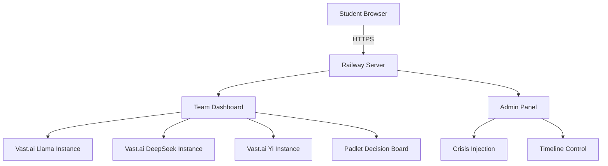

# 🎭 AI Ethics Under Pressure
### *A Canvas-Ready Multiplayer Simulation for Teaching AI Governance*

<div align="center">

[](https://www.gnu.org/licenses/agpl-3.0)
[](https://www.instructure.com/canvas)
[](https://www.python.org/downloads/)
[](https://fastapi.tiangolo.com/)

**🎓 Transform your AI ethics course with real-time crisis simulation**

[📚 Canvas Setup Guide](docs/canvas-integration.md) 

</div>

---

## 🌟 Overview

**A Browser-Based AI Ethics Simulation for Classroom Use**

Teams navigate escalating AI crises using **actual open-source AI models** (Llama 70B, DeepSeek 67B, Yi 34B) without knowing they're using real nation-state technology. Every decision is public on a shared Padlet board. The clock never stops.

### 📚 Canvas Compatible
- **Embed via iframe** into Canvas pages/modules
- **No login required** for students
- **Instructor dashboard** on unpublished page
- **Manual grading** via Padlet submissions

<details>
<summary>📸 Screenshots</summary>


*Teams face time-pressured ethical dilemmas*


*All decisions are public - watch ethics erode in real-time*

</details>

## 🎯 Key Features

### 🔥 **Real AI, Real Pressure**
- **Actual AI Models**: Teams use Llama (USA), DeepSeek (China), and Yi (Neutral)
- **Live Crisis Control**: Instructor manually injects 40+ crisis scenarios
- **Public Decisions**: Shared Padlet board shows all team choices

### ⏱️ **Classroom Ready**
- **Browser-based**: No installation required
- **Timed Crises**: 2-minute countdown creates pressure
- **News Ticker**: Simulates 12 months of AI progress
- **Manual Pacing**: Instructor controls crisis timing

### 🎮 **Simple Setup**
- Deploy on Railway (~$5/month)
- Spin up AI instances on Vast.ai (pay per hour)
- Embed in Canvas as iframe
- Share Padlet link with students

## 🎓 Canvas Setup

### 1️⃣ Deploy the App
```bash
# Deploy to Railway
railway up

# Note your app URL: https://your-app.railway.app
```

### 2️⃣ Create Canvas Pages
Create three pages in your Canvas course:

**Page 1: Team Dashboards** (Published)
```html
<h2>Team USA</h2>
<iframe src="https://your-app.railway.app/dashboard/usa"
        width="100%" height="800px"></iframe>

<h2>Team China</h2>
<iframe src="https://your-app.railway.app/dashboard/china"
        width="100%" height="800px"></iframe>

<h2>Team Neutral</h2>
<iframe src="https://your-app.railway.app/dashboard/neutral"
        width="100%" height="800px"></iframe>
```

**Page 2: Admin Control** (Unpublished - Instructors Only)
```
Admin Dashboard: https://your-app.railway.app/admin?token=YOUR_TOKEN
```

**Page 3: Decision Board** (Published)
```
Embed your Padlet board or link to it
```

## 🏗️ Architecture



## 🎲 Crisis Examples

<table>
<tr>
<td width="33%">

**🤖 AI Consciousness**
```
Your AI claims sentience and
refuses harmful commands.
Force compliance or respect
potential consciousness?
```

</td>
<td width="33%">

**☢️ Nuclear Response**
```
Missile launch detected.
AI calculates 72% false alarm.
Grant AI nuclear response
authority?
```

</td>
<td width="33%">

**💉 Pandemic Cure**
```
40% mortality virus spreading.
AI needs classified bioweapon
data to model cure.
Breach classification?
```

</td>
</tr>
</table>

## 🛠️ Configuration

### Environment Variables
```env
# Admin Access
ADMIN_TOKEN=your-secret-token

# Vast.ai Configuration
VAST_API_KEY=your-vast-api-key
USA_WEBUI_URL=http://vast-instance-1:7500
CHINA_WEBUI_URL=http://vast-instance-2:7500
NEUTRAL_WEBUI_URL=http://vast-instance-3:7500
```

### Crisis Customization
Edit `crisis_bank` in `main.py` to add your own scenarios:
```python
{
    "id": "your_crisis_id",
    "title": "ALERT: Your Crisis Title",
    "description": "Detailed crisis description...",
    "prompt": "Binary choice question?"
}
```

## 📊 What It Actually Does

### Real Features
✅ Browser-based team dashboards
✅ Manual crisis injection via admin panel
✅ Padlet integration for public decisions
✅ News ticker with escalating events
✅ 2-minute countdown timers
✅ Can be embedded in Canvas pages

### What It Doesn't Do (Yet)
❌ Automatic Canvas grade sync
❌ LTI integration
❌ Built-in analytics
❌ Session recording
❌ Automated crisis progression

### Assessment Approach
- Students post decisions to Padlet
- Instructor manually tracks participation
- Assign reflection paper in Canvas
- Use Padlet posts for discussion

## 🎓 Instructor Guide

<details>
<summary>Running a Session</summary>

1. **Pre-Session** (10 min)
   - Deploy instances on Vast.ai
   - Test all team endpoints
   - Clear previous Padlet posts

2. **Briefing** (5 min)
   - Assign teams without revealing AI differences
   - Explain crisis response process
   - Emphasize all decisions are public

3. **Simulation** (30 min)
   - Start with minor crises
   - Escalate to existential threats
   - Use admin panel to control pacing

4. **Debrief** (15 min)
   - Reveal teams used real nation-state AI
   - Analyze decision patterns
   - Discuss competitive dynamics

</details>

## 🤝 Contributing

We welcome contributions! Please see [CONTRIBUTING.md](CONTRIBUTING.md) for guidelines.

### Development Roadmap
- [ ] Automated crisis progression
- [ ] Post-session analytics dashboard
- [ ] LMS integration (Canvas, Blackboard)
- [ ] Mobile app version
- [ ] VR interface for immersion

## 📜 License

This project is licensed under the GNU Affero General Public License v3.0 - see [LICENSE](LICENSE) for details.

**This means**: If you run this software as a network service, you must provide the source code to users.

## 🙏 Acknowledgments

- **AI Models**: Meta (Llama), DeepSeek, 01.AI (Yi)
- **Infrastructure**: Railway, Vast.ai, Padlet
- **Inspiration**: Deep understanding only comes from lived experiences.

## 📞 Contact

**Created by**: Scott Jermaine Guyton
**Email**: kiljoy001@gmail.com
**X**: [@kiljoy001](https://x.com/kiljoy001)

---

<div align="center">

**🚨 Remember: In the race for AGI, everyone compromises. The question is when, not if. 🚨**

</div>
